# project-list

## Scrimba Solo Projects - Frontend Developer Career Path

Jul 2024 - Present

The Solo Projects are included in the Frontend Developer Career Path in Scrimba, their flagship course teaching programmer to be a junior frontend developer.

The project applies what I learned in the CSS courses. Scrimba provided me a Figma design, and the goal is to create a web page with HTML and CSS that is as close to the same design as possible.

Skills: HTML5 · Cascading Style Sheets (CSS)

[Scrimba - Solo Project - Basketball ScoreBoard](https://v2.scrimba.com/s0v81dffvp)\
[Scrimba - Solo Project - Hometown Homepage](https://v2.scrimba.com/s0nishp1a7)

## EasyA x Polkadot London Hackathon 2025 - Astartes.Dot

Apr 2025 - Apr 2025

What is Astartes.Dot?
Astartes is a tamper-evident logging and forensic audit system designed to enhance integrity in high-security infrastructure. It ensures that logs cannot be silently altered by internal actors—even with privileged access—by anchoring cryptographic proofs to a public blockchain and verifying log consistency across distributed systems.

Built with modularity in mind, Astartes uses lightweight agents to compute Merkle roots on each server, a centralized verifier to perform cross-checks and a blockchain publisher to anchor immutable proofs. This layered approach provides robust, post-event forensic traceability without introducing major overhead.

Astartes can operate independently or complement other systems like centralized detection-as-code frameworks. It’s designed for scale and becomes more cost-efficient as infrastructure grows—ideal for government departments and medium to large orgs.

[Astartes.Dot Demo Video](https://www.youtube.com/watch?v=IvcoDx7RJIk)\
[GitHub - The-Six/astartes_dot](https://github.com/The-Six/astartes_dot)

## Codecademy Learning - jQuery, Python 3, PHP, Bootstrap, Java, C#

Feb 2025 - Mar 2025

Continue the learning and completing projects after the Full-Stack Engineer Career Path on Codecademy.

[GitHub - hkmarcoot/100-days-of-code-2nd](https://github.com/hkmarcoot/100-days-of-code-2nd)

## Codecademy Learning - Full Stack Engineer Career Path

Sep 2024 - Feb 2025
Finish the projects listed in the course along with the learning.

[GitHub - hkmarcoot/100-days-of-code-2nd](https://github.com/hkmarcoot/100-days-of-code-2nd)

## Codecademy Code Challenge

Oct 2024 - Oct 2024

Joined Event:
Spooktober Code Challenge
Create pumpkin ASCII art.

[GitHub - hkmarcoot/100-days-of-code-2nd](https://github.com/hkmarcoot/100-days-of-code-2nd)

## Codewars Challenges, TypeScript Challenges and University of Code Challenges

May 2023 - Oct 2024
A collection of daily coding challenges, updated on weekdays - Part of my 2nd 100 days of code challenge on X.

Skills: Github · JavaScript · Jest · Mocha (JavaScript Framework) · Chai

[2nd 100 days of code challenge on X](https://twitter.com/marcotsang112)\
[GitHub - hkmarcoot/100-days-of-code-2nd](https://github.com/hkmarcoot/100-days-of-code-2nd)

## Friend Of Two - AI Powered Mutual Friend - Zero to One Hackathon by Convex Vol 2 in 2024

Sep 2024 - Sep 2024

Inspiration
Have you ever tried to get to know a new person but need more confirming information? Those who say they have known that person for a long time may not even have a deep understanding of him/her! With the power of AI, we can now create an AI-powered mutual friend to help solve this problem and make making a new friend easier. The AI is tailor-made by you so that what you like / dislike can be understood by anyone who wants to get close to you.

What it does
Users will create a chatroom with their tailor-made AI mutual friends by filling in their hobbies, interests, hates, and anything they want others to know. Other app users can enter the chatroom and ask questions about the AI owner. The AI mutual friend will reply to any question with the information given by the owner.

Skills: Convex · Convex Auth · React Native · TypeScript · iOS · Android · OpenAI

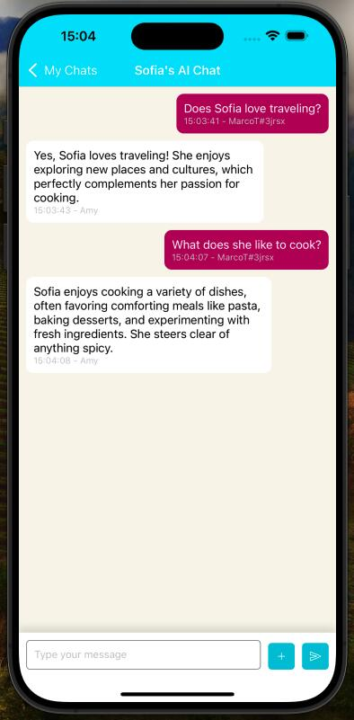
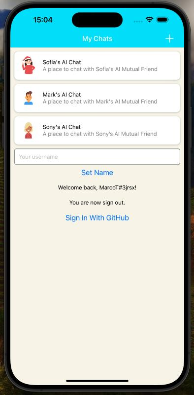
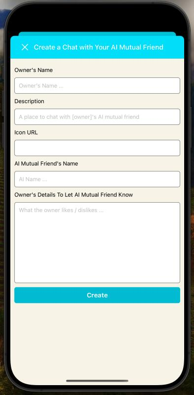

[GitHub - hkmarcoot/friend-of-two](https://github.com/hkmarcoot/friend-of-two)

## Ciptex Interview - Task Management App

Aug 2024 - Aug 2024

A task management app using WebSocket API with Lambda function and DynamoDB in the backend, and using Sockette websocket and Atlassian Drag and Drop Library in the React frontend.

The backend uses JavaScript and is implemented with real-time updates with WebSocket. It is a RESTful API and data is stored in AWS DynamoDB.

The frontend uses React and TypeScript. Realtime updates are implemented with Sockette websocket. Atlassian Drag and Drop Library is used for task management. It allows users to add new tasks and update task statuses.

A detailed walkthrough is included in both repos.

Skills: AWS Lambda · Amazon Dynamodb · AWS Identity and Access Management (AWS IAM) · Amazon Web Services (AWS) · WebSocket · React.js · TypeScript · Tailwind CSS · Vite · RESTful WebServices

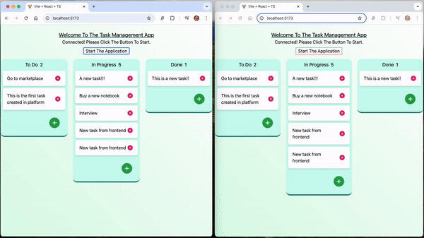

[GitHub - hkmarcoot/ciptex-task-management-backend](https://github.com/hkmarcoot/ciptex-task-management-backend)\
[GitHub - hkmarcoot/ciptex-task-management-frontend](https://github.com/hkmarcoot/ciptex-task-management-frontend)

## A Level CS Project - Tax Advisor and Calculator

Sep 2023 - Feb 2024

Associated with TeachAllAboutIT

This is a CS project that integrates binary search and ChatGPT into the Tax Advisor and an algorithm for calculating tax in the UK in 2022-2023.

A detailed and selected design section is included in the repo.

Skills: React.js · Tailwind CSS · ChatGPT · Vite · JavaScript

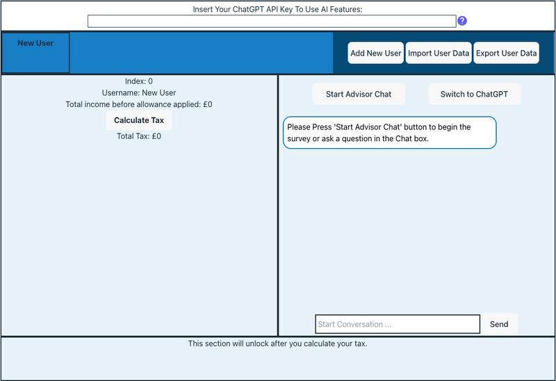

[GitHub - hkmarcoot/portfolio_A-Level-CS-NEA-Project](https://github.com/hkmarcoot/portfolio_A-Level-CS-NEA-Project)\
[A Level CS NEA Project Demo Website](https://marco-cs-portfolio.netlify.app/)

## Friend.tech, Grants Program, Custom Blockchain API From Hiro Hackathon 2023

Dec 2023 - Dec 2023

Finishing projects — from reshaping social spaces to crafting a custom blockchain API — has been an incredible exploration of Web3 frontiers.

Skills: Clarinet · Clarity · Chainhook · React.js · JavaScript · Tailwind CSS · HTML5

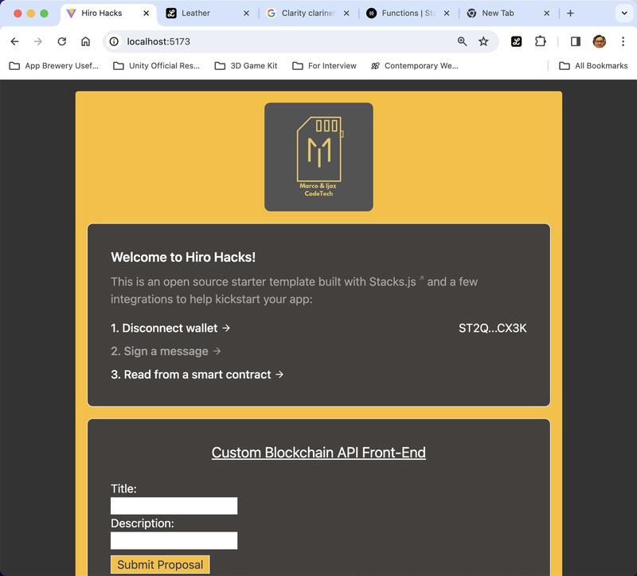
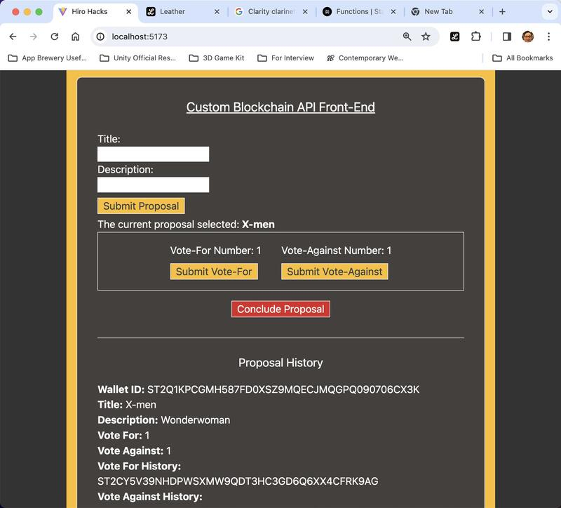

[GitHub - The-Six/Hiro-Hack3FrontEnd](https://github.com/The-Six/Hiro-Hack3FrontEnd)\
[GitHub - The-Six/Hiro-CustomBlockChainAPI](https://github.com/The-Six/Hiro-CustomBlockChainAPI)\
[GitHub - The-Six/Hiro-GrantsProgram](https://github.com/The-Six/Hiro-GrantsProgram)\
[GitHub - The-Six/Hiro-Friend.tech2](https://github.com/The-Six/Hiro-Friend.tech2)

## School Of Code Intern Project - Calendar EventTemplates

Mar 2023 - Jul 2023

Associated with School Of Code

We have created a solution that makes creating and storing event templates on Google Calendar quick and easy. No hidden costs, this service is completely free!

Please view our site for a detailed explanation:\
[Calendar EventTemplates Add-on Blogger Page](https://eventtemplatesadd-on.blogspot.com/p/how-to-install-and-setup-our-google.html)\
[Calendar EventTemplates On Google Workspace Marketplace](https://workspace.google.com/marketplace/app/calendar_eventtemplates/65028291685)\
[Calendar EventTemplates YouTube Promo Video](https://www.youtube.com/watch?v=nT6jivxzhoI)

Skills: Google Apps Script · Google Workspace · JavaScript

## School Of Code Intern Project - Meeting Booking System

Nov 2022 - Mar 2023

Associated with School Of Code

Implement a system that will allow bootcampers to book meetings via a link that they can send to other people to invite them to create an appointment, showing availability from the calendar.

Skills: React.js · Tailwind CSS · JavaScript · PostgreSQL · Node.js · Express.js · HTML5

## Percayso Interview 2 - GNews App

Feb 2023 - Feb 2023

A simple news web app to search for news and articles using gnews.io API.

Skills: React.js · Tailwind CSS · JavaScript

[GNews2 Demo Website](https://gnews-app-marco.netlify.app/)\

[GitHub - hkmarcoot/gnews-app](https://github.com/hkmarcoot/gnews-app)

## Frontend Mentor Projects

Oct 2022 - Jan 2023

I have practised on several frontend projects using the Frontend Mentor platform.

[Frontend Mentor Profile](https://www.frontendmentor.io/profile/hkmarcoot)\
[Frontend Mentor - Sunnyside Agency Landing Page](https://github.com/hkmarcoot/fementor-sunnyside-agency-landing-page)\
[Frontend Mentor - Base Apparel Coming Soon Page](https://github.com/hkmarcoot/fementor-base-apparel-coming-soon-master)\
[Frontend Mentor - Product Preview Card Component](https://github.com/hkmarcoot/fementor-product-preview-card-component)\
[Frontend Mentor - QR Code Component](https://github.com/hkmarcoot/fementor-qr-code)

## Scrimba Event - JavaScriptmas 2022

Dec 2022 - Dec 2022

A 24-day coding challenge from Scrimba to celebrate Xmas and win prizes.

[GitHub - hkmarcoot/100-days-of-code-2nd](https://github.com/hkmarcoot/100-days-of-code-2nd)

## ManyPets Hackathon in 2022

Sep 2022 - Sep 2022

A hackathon aiming to get hired by ManyPets insurance company as a Frontend Developer.

Skills: React.js · Cascading Style Sheets (CSS) · HTML5 · Node.js · Express.js · PostgreSQL

[GitHub - hkmarcoot/manypets-backend](https://github.com/hkmarcoot/manypets-backend)\
[GitHub - hkmarcoot/manypets-frontend](https://github.com/hkmarcoot/manypets-frontend)

## Percayso Interview 1 - Your News App

Sep 2022 - Sep 2022

A simple news web app to search for news and articles using gnews.io API.

[GNews1 Demo Website](https://newsapp-marco-tsang.netlify.app/)\
[GitHub - hkmarcoot/hackathon-yournewsapp](https://github.com/hkmarcoot/hackathon-yournewsapp)

## Lost And Found - Couchbase Hackathon in 2022

Aug 2022 - Aug 2022

A Lost And Found project showcasing the use of Couchbase Capella - a NoSQL cloud database.

Skills: Couchbase · Couchbase Capella · React.js

[GitHub - hkmarcoot/CBhackathon-backend](https://github.com/hkmarcoot/CBhackathon-backend)\
[GitHub - hkmarcoot/CBhackathon-frontend](https://github.com/hkmarcoot/CBhackathon-frontend)

## 1st 100 Days of Code Challenge

Nov 2021 - Mar 2022

Associated with School Of Code

I recorded what I learned in the 16-week School Of Code training in this repo.

Skills: React.js · Cascading Style Sheets (CSS) · JavaScript · Jest · Node.js · Express.js · PostgreSQL · MongoDB · HTML5

[GitHub - hkmarcoot/100-days-of-code](https://github.com/hkmarcoot/100-days-of-code)

## School Of Code Final Group Project - Xpeerience app

Feb 2022 - Mar 2022

Associated with School Of Code

A travel website that fights isolation and creates connections through shared interests.

[Demo Day: Downton Coders -xpeerience - Fight Isolation & Create Connections](https://www.youtube.com/watch?v=429SFcUHF9I)\

[GitHub - SchoolOfCode/final-project-repo-downton-coders-backend](https://github.com/SchoolOfCode/final-project-repo-downton-coders-backend)\
[GitHub - SchoolOfCode/final-project-front-end-downton-coders](https://github.com/SchoolOfCode/final-project-front-end-downton-coders)

## School Of Code National Project Week - Link Worthy

Jan 2022 - Feb 2022

Associated with School Of Code

A group project that saves our valuable links and notes from the School Of Code lessons in an organised way.

[GitHub - SchoolOfCode/national-project-week-link-worthy-back-end](https://github.com/SchoolOfCode/national-project-week-link-worthy-back-end)\
[GitHub - SchoolOfCode/national-project-week-link-worthy-front-end](https://github.com/SchoolOfCode/national-project-week-link-worthy-front-end)

## My First React Project - NASA International Space Apps Challenge 2020

Oct 2020 - Oct 2020

Associated with Techbob Academy Hong Kong

A challenge aiming to create a schedule for astronaut.

Skills: TypeScript · Syncfusion · React.js

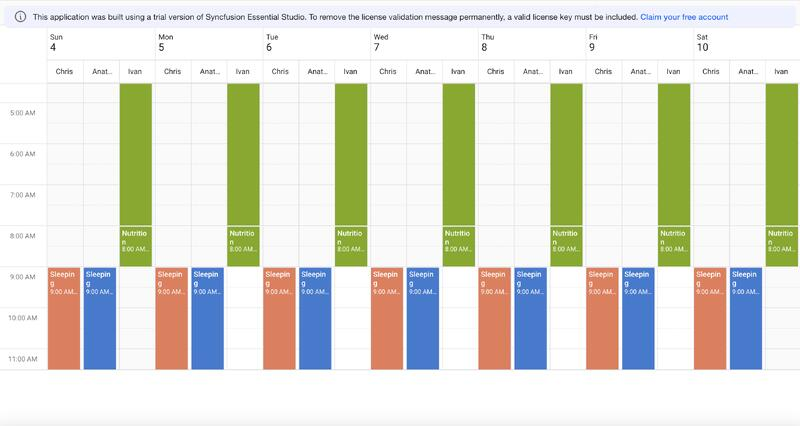

[GitHub - hkmarcoot/spaceapps2020](https://github.com/hkmarcoot/spaceapps2020)

## COVID-19 Hong Kong Information Center - MIT App Inventor Hackathon 2020

Jul 2020 - Aug 2020

Associated with Techbob Academy Hong Kong

It is an Android App created using the MIT App Inventor. With this app, I won 3rd place in the adult track in the MIT App Inventor Hackathon 2020. The app provides live information about COVID-19 to app users in Hong Kong.

One of the app's key features is its ability to provide live walking alerts, warning users if they are within 20 meters of infected locations. These locations are marked with a red dot, and you can access more information by pressing on the marker. Only markers in close proximity to you will be shown.

The second feature of the app is to show all the locations in Hong Kong that were infected within 14 days on the map. You can have an overview of the situation in Hong Kong. Again, you can know more by clicking on the markers.

The third feature directs users to the Hong Kong government's COVID-19 news webpage. You can read the latest news here.

The final feature is to read the database in a list view. You can check the case number and the infected locations in a list.

Skills: App Inventor

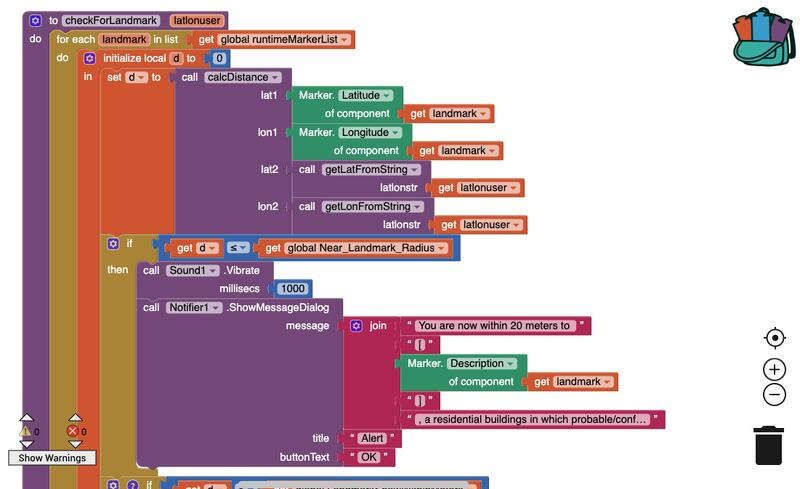\
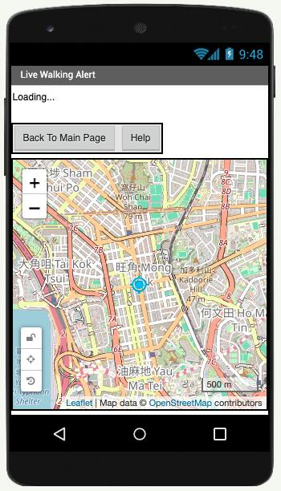\

## Baked Tales - Android Game Developed with Unity

Nov 2019 - Jan 2020

Associated with Feva Works IT Education Centre

A 2D platformer game like the Mario. User controls chef dog to fight enemies, collect food and reach the end point to complete the game.

Skills: Unity · C# · Android

[GitHub - hkmarcoot/BakedTalesPlayerController](https://github.com/hkmarcoot/BakedTalesPlayerController)

## 3 Games Made with Unity in .exe File Format (Chinese Language)

Jul 2019 - Sep 2019

Associated with Feva Works IT Education Centre

Final projects for passing the Certificate in Unity Game Design and Development course.

1.Room Escape:
Download Link: https://1drv.ms/u/s!AhtUYa1WFdeYg-1SuXec9hpHVyhnUg?e=r39X4l

2.90s HK Online Game Q&A:
Download Link: https://1drv.ms/u/s!AhtUYa1WFdeYg-1TittDpyePTtAhmg?e=EbXknz

3.Terrain & Unity Summer Camp:
Download Link: https://1drv.ms/u/s!AhtUYa1WFdeYg-1aLgKhjjmzndZgkg?e=NBpvDs

Skills: Unity · C#

\
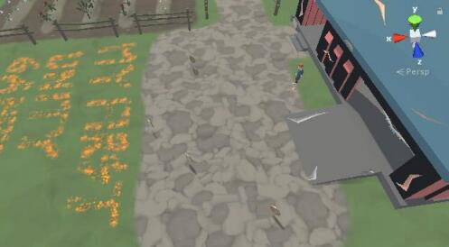\
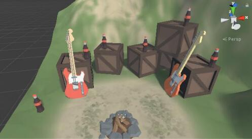

## Electronic Bookcrossing Box - Secondary School IoT Design Compeition 2017

Feb 2017 - Apr 2017

Associated with Cheung Chau Government Secondary School

Led a school team to join an IoT competition by submitting a electronic bookcrossing box project and won 3rd runner-up.

Skills: App Inventor

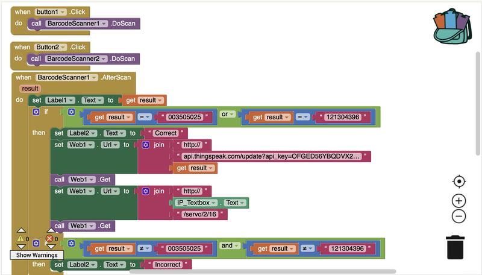\
\
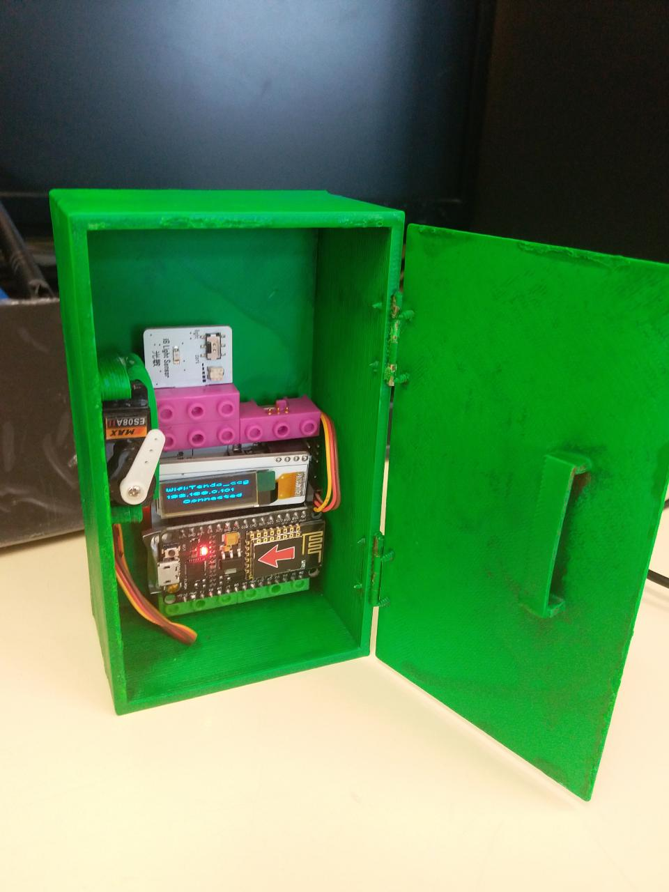\
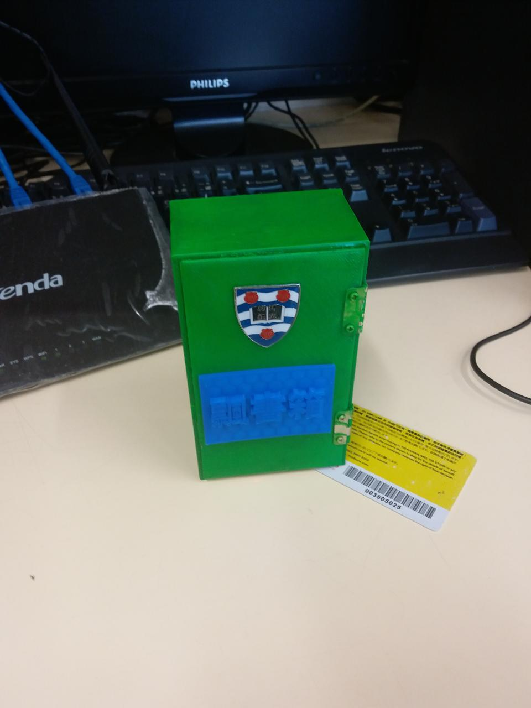\

## Astronomy Programming Workshop

Jul 2012 - Aug 2012

Create a program in Python that can adjust the contrast of NASA's space image so that the human eye can see more stars. A simple comparing program was also created as my final project to show the difference between two space images.

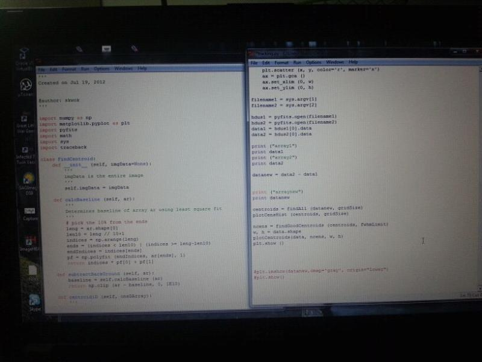\
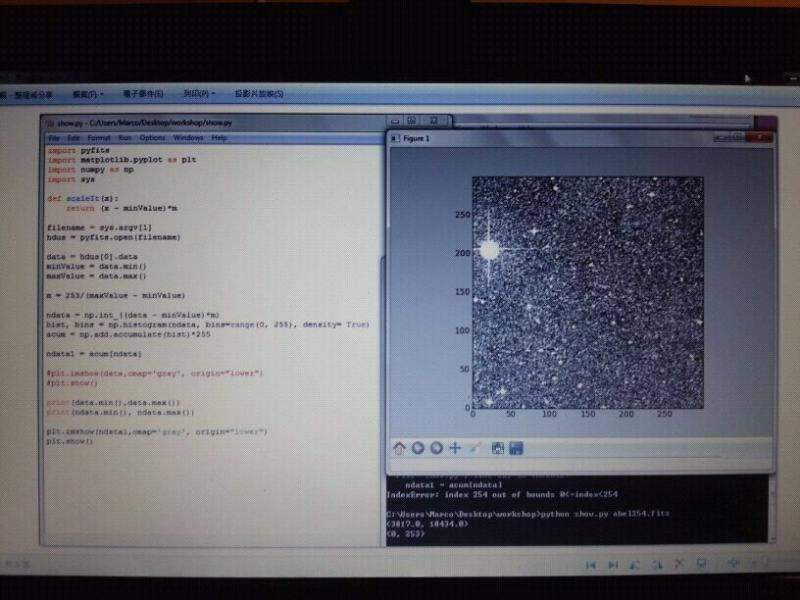\
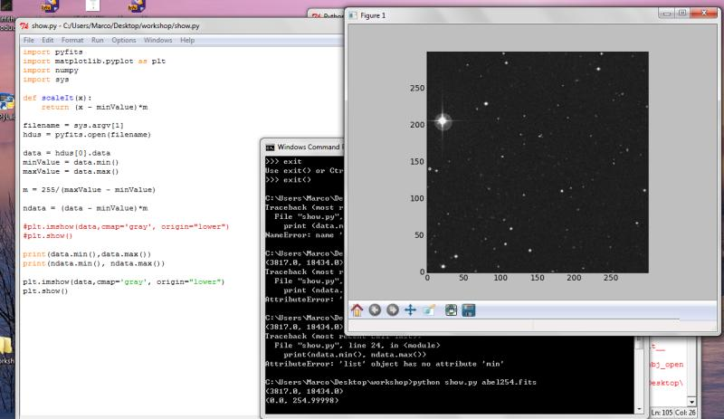\
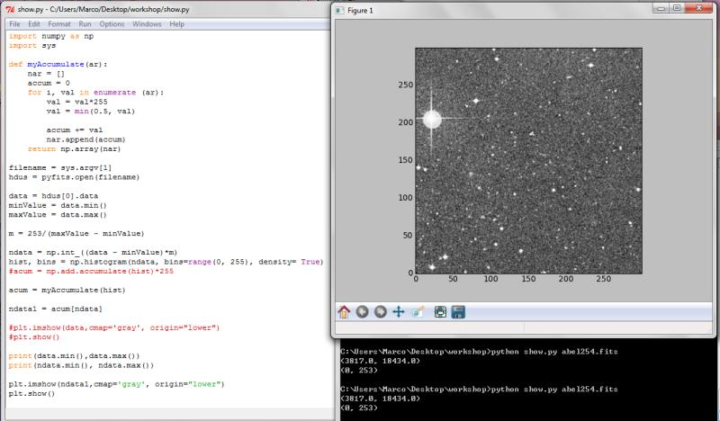\
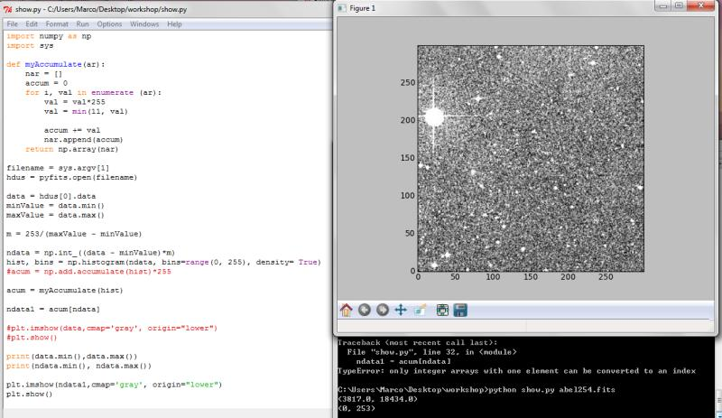\
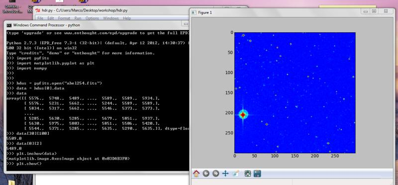

## Electronic and Electrical Engineering Learning

Jun 2012 - Aug 2012

Learn EEE by working with the teaching assistant to control a remote-controlled car using a computer and programming instead of the original remote car controller. The second task was to try to make the three-phase motor work using wires, electrical components and a breadboard. The last task, which was not about EEE, was to redesign the mechanism of a flute-playing robot.

\
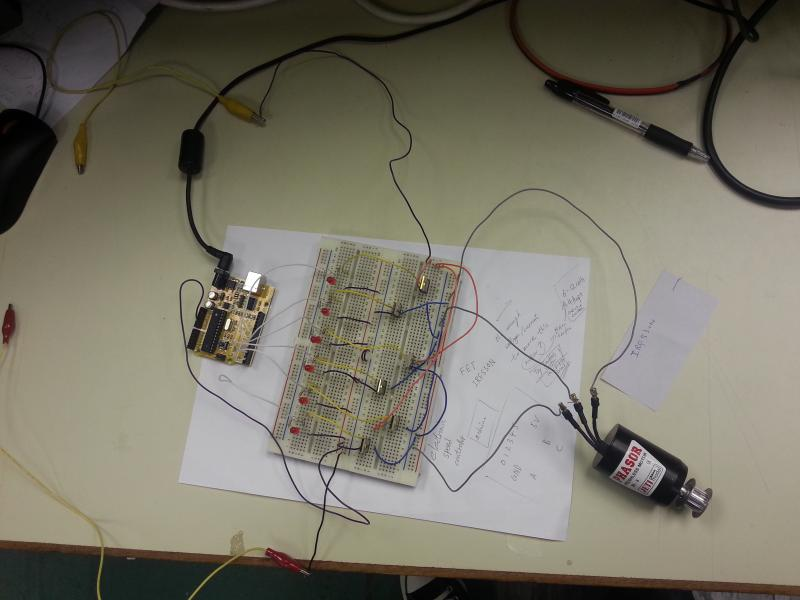\
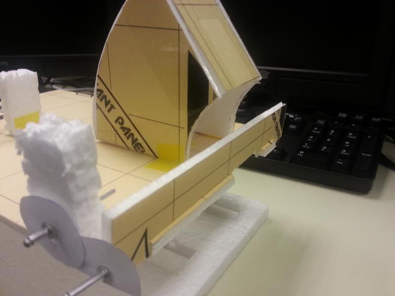

## First Programming Project - Dictionary Program Built with C

Dec 2007 - Feb 2008

Create a dictionary program built with C programming to submit for the HKCEE Computer and Information Technology coursework. The program can check and highlight incorrect English words and count the number of selected words. However, checking for grammar was more difficult than I could handle.
